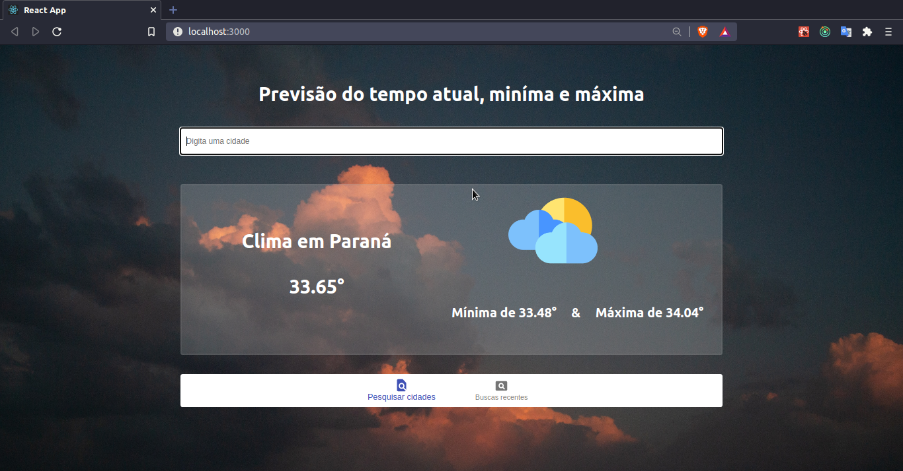
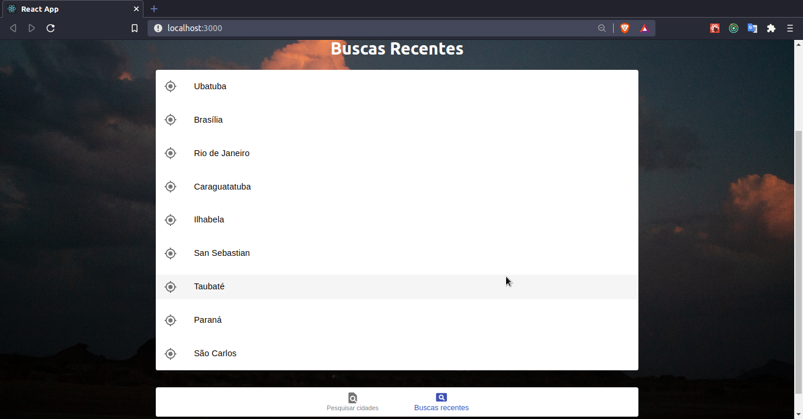
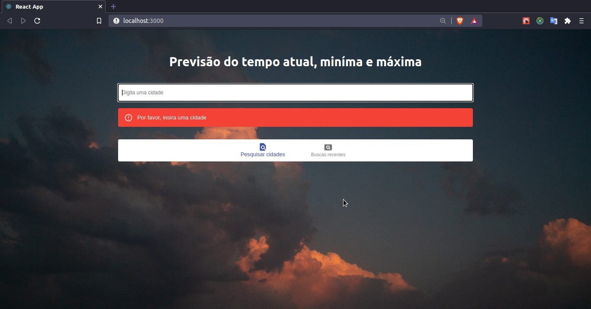
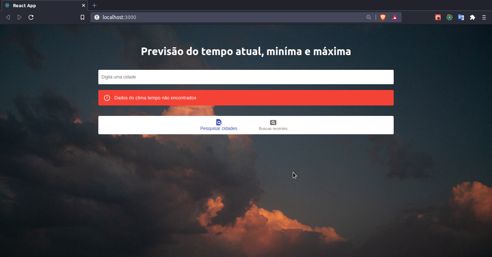
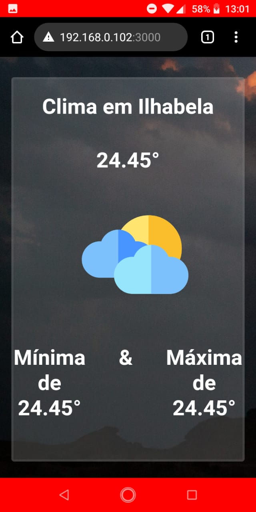
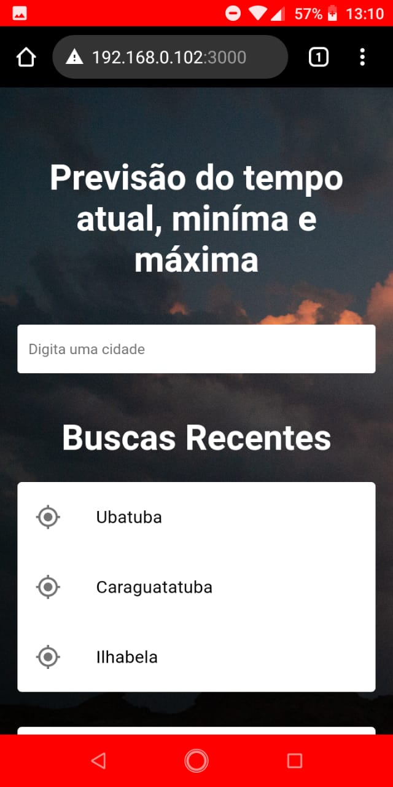

# Clima tempo Avaliação Projeto Frontend

Projeto para busca de temperatura atual, máxima e miníma de cidades.

## 💻 Web preview

<h1 align="center">
    
</h1>

📷 [Imagens](#-outras-imagens)

---

## ℹ️ Sobre o projeto

- ✅ Desenvolvido para avaliação no processo seletivo para vaga de frontend developer!

- ✅ O projeto tem como objetivo realizar a busca de qualquer cidade e retornar sua temperatura atual, miníma e máxima.Também deve se gravar os locais buscados até o momento.

- ✅ Através do Redux persist conseguimos manter o histórico de cidade já pesquisadas, assim o usuário pode clicar nela e conferir todas suas informações.

- ✅ Um dos pontos a destacar é que pode pesquisar qualquer cidade incluindo de outro país. Um dos diferenciais foi isso. Eu optei por fazer inputs onde captura a cidade que o usuário digitar, assim não fica limitado a tres cidades apenas.

* ✅ Algumas personalizações: Fiz o uso do efeito ThreeDots da biblioteca react-loader-spinner para o carregamento de dados, para ter um pouco mais de interação. Além disso também coloquei Alert de erro para quando o usuário esquecer de digitar a cidade ou a mesma não ser encontrada.

* OBS: Se o resultado for igual pra ambas temperaturas, é normal, pois ele faz calculo aproximado, e certas cidades acontecem de ter a temperatura minima e máxima iguais a atual. Experimente cidades como Paraná, São Paulo e Rio de Janeiro, essas a temperatura fica normal.

* Você precisa configurar todo o ambiente react.js instalando suas dependencias através de um dos comandos abaixo:

-  - npm install

-  - yarn install

---

## ⚫ Na pasta Web (frontend):

🔲 Inicie o frontend também com o comando do yarn.

## 🕵️ Observação:

📜 Eu conseguiria fazer o uso do ícone da api porém ia deixar o código um pouco verboso. Por isso optei por deixar um estático.

---

## 🚀 Tecnologias usadas

💚 Frontend:

- 

- 

- 

- 

- 

* 🗃️ Outras Bibliotecas que usei:

* 

* redux-devtools-extension
* redux-logger
* redux-persist
* redux-thunk
---

Teste a aplicação online [clicando aqui][linkapp]

## 📷 Outras Imagens

    

        
        &nbsp;&nbsp;
        
    

 <h2 align="center">
     
 </h2>

    

        
        &nbsp;&nbsp;
        
    

<h2 align="center">
👨‍💻 Developer

De @JulioCesar012 para Processo Seletivo Ambar

Feito com muito 💚 e muito ☕!
</h2>

[linkapp]:https://climatempo2021.herokuapp.com
